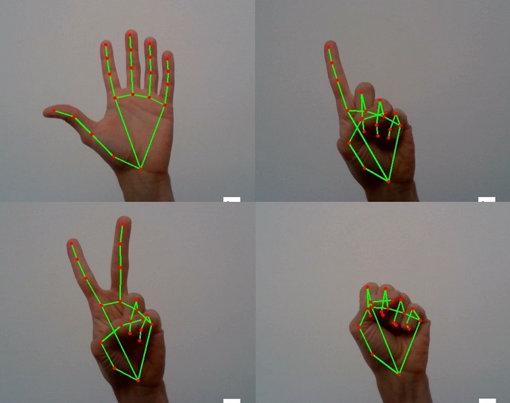
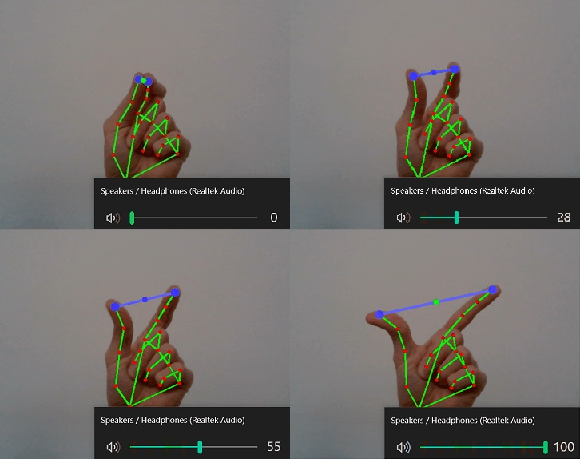

## Hand Tracking

Simple computer vision application for hand track in an image. 
Draw 21 hand landmarks per hand.
Read video image with OpenCV. For hand detection use [MediaPipe](https://google.github.io/mediapipe/solutions/hands), 
a pretrained framework by Google.

<kbd></kbd>

### Volume Hand Control

Extended use of Hand Tracking module for Volume Hand Control. Hand landmarks adjust volume of the Operating 
System. The volume percentage is controlled by the distance from the tip of pointing finger to thumb.
[pycaw](https://github.com/AndreMiras/pycaw) library allows to set the volume remotely.

<kbd></kbd>

### How to use

```
# Clone repository
$ https://github.com/albertkuc/HandTracking.git

# Install dependencies
$ pip install -r requirements.txt
```

### Credits

Based on YouTube [Hand Tracking tutorial](https://www.youtube.com/watch?v=NZde8Xt78Iw) and 
[Gesture Volume Control tutorial](https://www.youtube.com/watch?v=9iEPzbG-xLE) by Murtaza's Workshop - Robotics and AI.